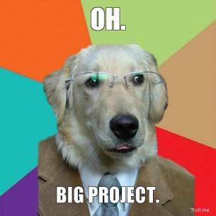

    
 Logan Arnett

    

    <ul id="nav">
        <li><a href="http://loganarnett.github.io/">About</a></li>
        <li><a href="http://loganarnett.github.io/">Blog</a></li>
        <li><a href="https://github.com/LoganArnett?tab=repositories">Portfolio</a></li>
        <li><a href="http://loganarnett.github.io/">Contact</a></li>
    </ul>
    

 
 
 

# Welcome to The Iron Blog!
This is where I will keep you all up to date about my web development
adventures here at [The Iron Yard](http://theironyard.com/) Academy. As part
of the inaugural class for the [Orlando, FL](http://theironyard.com/locations/orlando/), location I
am taking my first steps towards a new career. This page will contain blog posts,
project updates, and of course completed projects as I move through the program
and on into my web development career. If you have any questions or would like 
to get in contact with me about collaborating definitely check out my [Contact Info](#contact)
and Social Media pages. I look forward to sharing this journey with my amazing
classates and for all of you to witness us evolve into Web Developers in the 
center of the buzzing Central Florida Tech Community!

###The Ironing Board

[Week 1 is in the Books](http://loganarnett.github.io/2014/09/26/Week-1-is-in-the-Books)

[First Big Project](http://loganarnett.github.io/2014/09/25/First-Big-Project)

[Day 3..2.1 GO!](/2014/09/24/Day-3-2-1-Go)

[The Iron Blog Has Landed](/2014/09/23/The-Iron-Blog-Has-Landed)

[We Have Liftoff](/2014/09/22/We-Have-Liftoff)

###Portfolio

[LoganArnett.Github.io](https://github.com/LoganArnett/LoganArnett.github.io)

[TIY Assignments](https://github.com/LoganArnett/TIY-Assignments)

[Etsydemo](https://github.com/LoganArnett/etsydemo)

###Get in Touch

* Name

* Email
 
* Phone

* Message

